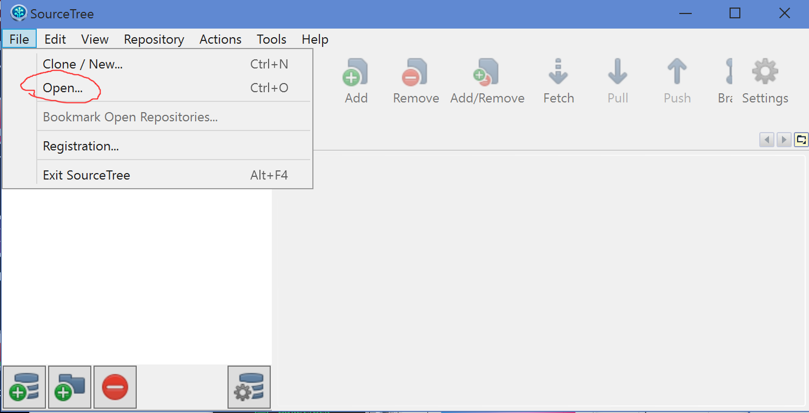
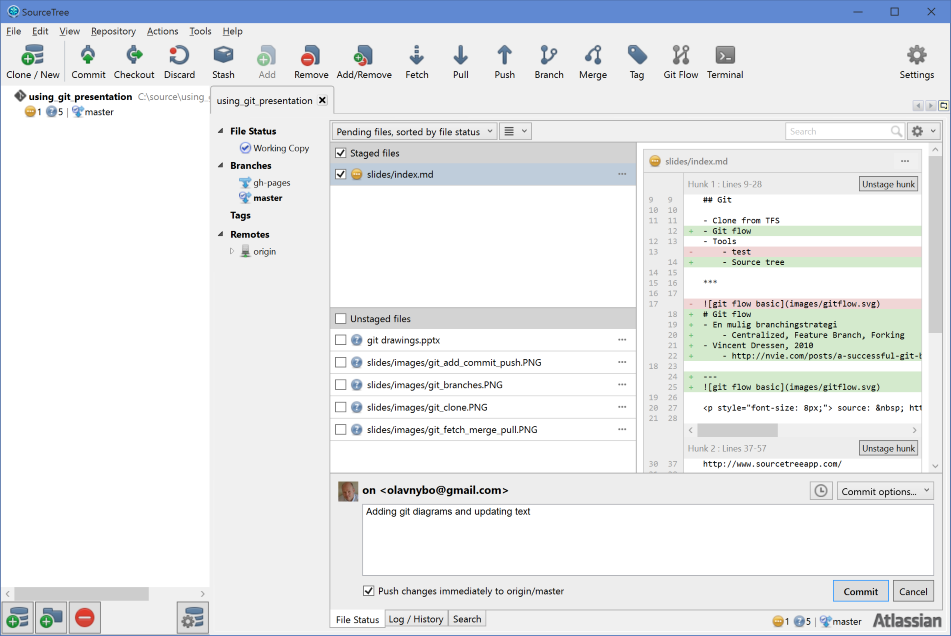

- title : Git intro
- description : Short presentation about GIT and Git flow
- author : Olav Nybø
- theme : sky
- transition : default

***

## Git

- Clone from TFS
- Git flow
- Tools og Git 101
    - Source tree
    - GitFlow for Visual Studio

***
### Migration TFS -> GIT
#### Oppskrift her
https://github.com/git-tfs/git-tfs/blob/master/doc/usecases/migrate_tfs_to_git.md

Det viktigste er å kjøre
    git tfs clone collection --with-branches

---
## Men
- Vi fikk det ikke til å fungere på web claims
- Clonet uten historie
- Planen var å beholde repository i TFS for historie
- Men vi har ikke tilgang?
- Foreløpig ikke noe stort problem

***

# Git flow
- En mulig branchingstrategi
    - Centralized, Feature Branch, Forking
- Vincent Dressen, 2010
    - http://nvie.com/posts/a-successful-git-branching-model/

---

 source: &nbsp; https://www.atlassian.com/git/tutorials/comparing-workflows/gitflow-workflow 

---

 source: &nbsp; https://www.atlassian.com/git/tutorials/comparing-workflows/gitflow-workflow 

***
## SourceTree
http://www.sourcetreeapp.com/

---
#### Open repository

---
#### GIT Clone

---
#### GIT Add Commit and Push

---
#### GIT Fetch Merge Pull

---
#### GIT Branches

---

### SourceTree commit and push

---
## GitFlow for Visual Studio
- godt alternativ til SourceTree om en ikke har node foldere i prosjektet
https://visualstudiogallery.msdn.microsoft.com/27f6d087-9b6f-46b0-b236-d72907b54683

***

### Erfaringer
- Mye kjappere
- npm og windows er ikke gode venner
- En bedre utvikler hverdag
